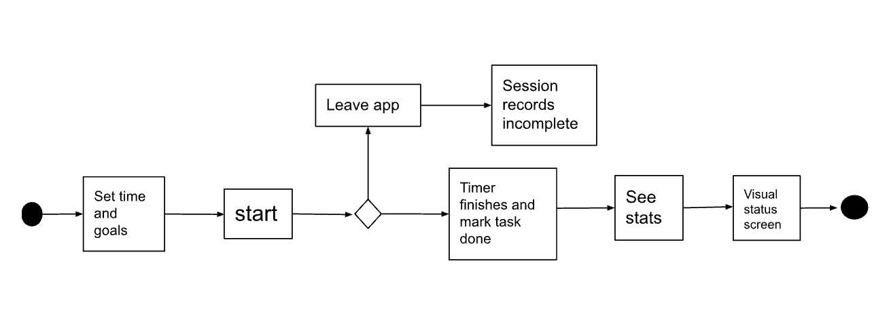

# Specification Phase Exercise

A little exercise to get started with the specification phase of the software development lifecycle. See the [instructions](instructions.md) for more detail.

## Team members

[Hugo Bray](https://github.com/BringoJr)  
[Sahar Bueno-Abdala](https://github.com/saharbueno)  
[Nuzhat Bushra](https://github.com/ntb5562)  
[Tamara Bueno](https://github.com/TamaraBuenoo)  
[Annabeth Gao](https://github.com/bellinimoon)

## Stakeholders

- Students
- Procrastinators
- People with busy schedules
- People who struggle with time management focus

### User Needs

#### 1. Reward System for Achieving Goals

- Users need a sense of achievement. A reward system, such as unlocking a cute character or object (e.g., a cat, plant, etc.), will help users feel a sense of accomplishment after completing focused work.

#### 2. Simple, Easy-to-Use Interface

- Users need an intuitive interface that simplifies setting a time for focused work without overcomplicating the process, making it easy to jump into their tasks.

#### 3. Tracking Progress

- Users need a tracker that visually shows their progress, such as the total time they've focused or goals they've achieved. This helps them feel more engaged and encouraged to continue.

#### 4. Consequences for Not Focusing

- Users may benefit from a system that creates a consequence for distractions or breaks in focus (e.g., losing a reward). This helps maintain accountability and nudges users to stick with their focus sessions.

### User Problems

#### 1. Lack of Motivation

- Users find it difficult to stay motivated, especially when the tasks they need to complete aren't enjoyable or rewarding. This leads to procrastination.

#### 2. Difficulty in Keeping Track of Tasks

- Users often feel overwhelmed by the sheer number of tasks or responsibilities they need to juggle, leading to disorganization and a lack of focus.

#### 3. Low Accountability

- Users struggle with self-accountability, meaning they have trouble sticking to the goals they've set without external enforcement or reminders.

#### 4. No Visible Progress

- Users often don't see the impact of their focused efforts in real-time, leading to frustration and demotivation when progress feels invisible or slow.

## Product Vision Statement

- Our app is designed to improve productivity by creating a fun, game-like environment where users track and complete tasks, earning rewards such as bunnies for staying focused, making it easier for students and busy individuals to stay motivated and engaged in their work.

## User Requirements

- As a user, I want to earn rewards, like virtual bunnies, for staying focused during study sessions so that I feel motivated to complete my tasks and improve my concentration over time.

- As a student, I want to visually track my progress on tasks with a daily/weekly/monthly view, showing the time spent on each task, so that I can feel accomplished when I hit my goals.

- As a procrastinator, I want to feel a sense of urgency and importance when doing my tasks, so that I can focus better and stress less

- As a goal-oriented person, I want to see a progress bar or tracker for my study sessions in real-time, with clear indicators of how long I’ve focused versus how much time remains, so that I can visually measure my productivity and stay motivated during long sessions.

- As a unmotivated individual, I want a consequence for breaking focus, like losing my progress toward the next virtual bunny reward, so that I stay accountable to my study goals and think twice before leaving the app for distractions.

- As an easily bored person, I want the app to use fun and interactive elements, such as animations, themes, or sound effects, to create an engaging study environment, helping me stay engaged in my studies consistently.

- As a busy professional, I want the option to customize my study timers with different durations and breaks so that I can tailor my focus sessions to fit my unpredictable schedule and maximize my productivity.

- As a results-driven person, I want to set specific milestones within the app, such as completing a certain number of minutes studied, so that I can track my achievements and celebrate reaching those goals.

- As a distraction-prone individual, I want the app to include features that temporarily block notifications from other apps during my focus sessions, so that I can immerse myself fully in my studies without interruptions

- As a reflective learner, I want to be able to see the amount of times I studied in certain time intervals, so I can decide where I need to improve with my study habits.

## Activity Diagrams

### User Story UML One

* "As a student, I want to visually track my progress on tasks with a daily/weekly/monthly view, showing the time spent on each task, so that I can feel accomplished when I hit my goals."

### User Story UML Two

* "As a procrastinator, I want to feel a sense of urgency and importance when doing my tasks, so that I can focus better and stress less"

## Wireframe cdDiagrams
[Figma Link to Wireframes](https://www.figma.com/design/cGfssq0dgAoQ815AAxkKvm/Project-1-Study-APP?node-id=0-1&t=08KAjFnLozGUm6bn-1)

## Clickable Prototype
[Clickable Prototype](https://www.figma.com/proto/cGfssq0dgAoQ815AAxkKvm/Project-1-Study-APP?node-id=24-40&node-type=canvas&t=bi1DMLfB4yxG0cp8-1&scaling=scale-down&content-scaling=fixed&page-id=0%3A1&starting-point-node-id=2%3A139)
